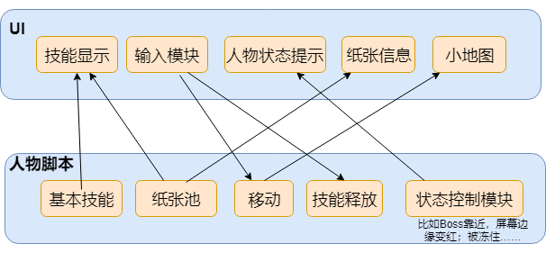

# TXminigame
Minigame project in Tencent game planning course

## Objects
- 人物
- Boss
- 纸张（本身会发亮）
- 原书
- 传送点

## Interaction
- Boss 在人物附近X米半径内，人物屏幕边缘会变红
- Boss 站上传送点等待X秒后，随机选定传送点传送。中断时传送失败
- Boss 攻击半径内有人物，点击屏幕按到人物，人物被扁平化成2D图片消失，回到原书
- Boss 踩到人物技能使用留下的陷阱，有状态变化。
- 人物 走到纸张附近，按下纸张X秒解锁纸张。若中途离开，解锁时间会被存档。
- 人物 在原书附近，按下原书X秒解救队友，中途离开，解锁时间不存档。
- 人物 使用复活技能，在原书附近X米半径内使用技能都可以使人物复活。
- 人物 消耗纸张使用技能，确定攻击目标/移动方向。有引导时间，中途打断则纸张被浪费，技能不释放。若成功释放，人物状态变化/陷阱实例化。
- 人物 使用基础技能，步骤同上。不同点是技能有冷却时间
- 人物 在原书中呆了X秒无人来救，则死亡。该人物纸张清零，不算做团队成就。
- 人物 点击队友，选择自己拥有的纸张赠送
- 技能 基础技能/书籍技能 
    - 蓝色：设置陷阱 boss碰到会冻住。陷阱是人物可以看到，boss看不到的。人物可以放在Boss的必经之路上。只要Boss不踩到，此陷阱就永久有效。（基础技能）
    - 红色：设置陷阱 boss碰到会行走变缓慢一段时间。（基础技能）
    - 绿色：设置陷阱 boss碰到会黑屏 屏幕上加一个黑色蒙版。（基础技能）
    - 白色：站在原书附近范围X米内使用技能可以使得队友复活。 人物走到该范围内，UI小地图上被封印队友的图标会闪动作为提示。（书籍技能）
    - 黑色：自己隐身，可以隐身无限长时间，不操作移动就可以一直隐身。（书籍技能）
    - 金色：自己闪现一段距离。（书籍技能）
- 系统 用户注册、登陆管理。
- 系统 玩家进入游戏，选择游戏角色
- 系统 玩家死亡/胜利的场景切换 给相应的故事内容
- 系统 视野 2.5D

## UI
- 接收人物移动信息
- 各人物获得的书籍、各人物死亡状态显示在左上角
- 小地图中人的显示
    - 人物：知道队友所在位置、原书位置；使用复活技能是如果走到原书有效半径内，原书在小地图UI上的点会跳动
    - Boss：知道所有未解锁纸张位置、原书位置
- 书籍技能按键
    - 搜集到纸张后点亮技能、赠送纸张后技能清除、技能使用后技能清除
    - 选择使用哪个技能
    - 确定技能释放对象/技能方向/释放的陷阱位置
    - 技能进入引导阶段
    - 技能生效
- 基础技能按键
    - 冷却时间等待
    - 其他如上

## FlowChart
