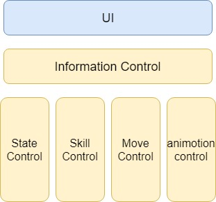

# TXminigame
Minigame project in Tencent game planning course

## Objects
- 人物
- Boss
- 纸张（本身会发亮）
- 原书
- 传送点
- 陷阱（prefab）

## Interaction
- Boss 在人物附近X米半径内，人物屏幕边缘会变红（周）
- Boss 站上传送点，UI上跳出界面供Boss选定传送点（比如地图上一共10个传送点），然后等待X秒后被传送，期间移动位置则传送失败（周）
- Boss 如果攻击半径内有人物，点击屏幕按到人物，人物被扁平化成2D图片消失，回到原书。如果Boss成功捉到人，之后会一段缓冲时间（行走缓慢且不能点击人物），才能继续捉下一个人。（周）
- Boss 踩到人物技能使用留下的陷阱，根据陷阱类型的不同，有状态变化。这部分和负责陷阱技能的人沟通（周）
- 人物 走到纸张附近，按下纸张X秒解锁纸张。若中途离开，解锁时间会被存档。纸张上显示解锁进度。解锁到50%的进度时候 Boss的UI地图上该纸张会闪动（周）
- 人物 在原书附近，按下原书X秒解救队友，中途离开，解锁时间不存档。原书上显示解锁进度（文）
- 人物 使用复活技能，在原书附近X米半径内使用技能都可以使人物复活。（文）
- 人物 消耗纸张使用技能，确定攻击目标/移动方向。有引导时间，中途打断则纸张被浪费，技能不释放。若成功释放，人物状态变化/陷阱实例化。（谢）
- 人物 使用基础技能，步骤同上。不同点是技能有冷却时间（谢）
- 人物 在原书中呆了X秒无人来救，则死亡。该人物纸张清零，不算做团队成就。（陈）
- 人物 人物行走中会留下脚印，比如身后一共5个脚印，以单位时间采样。增加Boss追踪机率。（文）
- 人物 消耗一张纸张后 地图中会在随机位置出现一张（陈）
- 人物 /*点击队友，选择自己拥有的纸张赠送*/
- 技能 基础技能/纸张技能 
    - 设置陷阱 boss碰到会冻住。陷阱都是人物可以看到，boss看不到的。人物可以放在Boss的必经之路上。只要Boss不踩到，此陷阱就永久有效。（基础技能）（陈）
    - 设置陷阱 boss碰到会行走变缓慢一段时间。（基础技能）（谢）
    - 设置陷阱 boss碰到会黑屏 屏幕上加一个黑色蒙版。（基础技能）（陈）
    - 白色：站在原书附近范围X米内使用技能可以使得队友复活。 人物走到该范围内，UI小地图上被封印队友的图标会闪动作为提示。（纸张技能）（文）
    - 黑色：自己隐身，可以隐身无限长时间，不操作移动就可以一直隐身。（纸张技能）（文）
    - 金色：自己闪现一段距离。（纸张技能）（谢）
- 系统 用户注册、登陆管理。
- 系统 玩家进入游戏，选择游戏角色。
- 系统 玩家死亡/胜利的场景切换  成就机制：每次任务获得一次胜利均可以解锁其自身独有的小故事（选自格林童话，将一个童话分割为数节，分次解锁）Boss获胜可解锁任意人物小故事一节。
- Basic structure （谢）
## UI
- Basic structure（陈）
- 接收人物移动信息，传给InfoControl
- 各人物获得的书籍、各人物死亡状态显示在左上角
- 小地图中人的显示
    - 人物：知道队友所在位置、原书位置；使用复活技能是如果走到原书有效半径内，原书在小地图UI上的点会跳动
    - Boss：知道所有未解锁纸张位置、原书位置
- 书籍技能按键
    - 搜集到纸张后点亮技能、赠送纸张后技能清除、技能使用后技能清除
    - 选择使用哪个技能
    - 确定技能释放对象/技能方向/释放的陷阱位置
- 基础技能按键
    - 冷却时间等待
    - 其他如上

## Game Architecture 

#### Class
+ SkillBase
	+ `SKILL`
	+ `SKILL_FALSH`
	+ `SKILL_REVIVE`
	+ `SKILL_HIDE`
	+ `SKILL_TRAP_SLOW`
	+ `SKILL_TRAP_ICE`
	+ `SKILL_TRAP_BLIND`

+ PeopleBase
	+ `PEOPLE`
		+ FREE
		+ BEGIN_SKILL
		+ EXECUTE_SKILL
		+ END_SKILL
		+ ICE
		+ SLOW
		+ BlIND
#### Control
+ UI control
	+ `MovementUpdate()`接收上下左右控制移动的信息,传到info层（info层给movement层）
	+ `HandleClick()`接收点击的信息，比如人和纸张交互，Boss抓人
	+ `ShowSkill()`展示技能信息
	+ `SkillUpdate()`判断是否能使用技能、 使用哪个技能、获取技能参数，传给info层
		+ `HandleGetKeyEvent(SKILL _skill)`按着技能键，然后要获取技能所需的方向，位置等信息。现在用键盘按键 0 1 2 3 4 代替
		+ `HandleGetKeyUpEvent(SKILL _skill)`释放技能键
+ infomation control
	
	+ 公共变量管理（人物基本技能，纸张技能，状态等）
	+ 和UI的交流（UI要获取的信息，以及UI送过来的信息，都通过这个类）
	+ 本地模块间也通过这个类交流（比如当MoveControl需要人物状态时）
	+ 维护一个`next_skill_to_begin`，每次发动技能前UIControl需要设定技能所需的信息，传到InfoControl然后变成`current_skill`
	+ 管理基本技能basicSkill 和纸张列表pageSkills,同时提供以下接口:
		+ `void addPageSkill(string _page_name)`UIControl中调用
		+ `void deletePageSkill(SKILL _skill)`skillControl中调用

+ state control
	+ 人物状态控制，比如人物处于END_SKILL要删除纸张或者恢复基本技能的冷却、引导时间
	+ 人物状态改变，提供`void transStateTo(int targetState)`
	+ 判断人物状态是否可以变化（还没做）
	+ 维护人物状态维持时间（比如冰冻三秒后自动改变状态，还没做）

+ skill control
	
	+ 维护BEGIN_SKILL和EXECUTE_SKILL
	+ 负责技能的冷却
	+ 技能的执行顺序：
		+ UI层判断技能能否执行
		+ UI层获取执行的技能，以及技能的对象或方向或位置，实时显示在UI上
		+ UI层传递信息至information层
		+ information层判断技能能否执行（暂时没有再做判断）
		+ 可以执行，通知state control改变状态为BEGIN_SKILL
		+ skill control维护技能状态
	+ 发动技能的三个阶段
		+ `BEGIN_SKILL`
		+ `EXECUTE_SKILL`
		+ `END_SKILL`
	+ 注意：
		+ `BEGIN_SKILL`时在MoveControl中打断技能时，更改人物状态为`END_SKILL`
		+ `EXECUTE_SKILL`时不接收移动信息
		+ END_SKILL时基础技能需要恢复技能冷却时间和引导剩余时间
		+ 如果为纸张技能，需要将技能（纸张）删了

	
+ move control
	+ 控制移动
	
+ animotion control
	+ 根据状态和必要信息，控制动画的播放

	